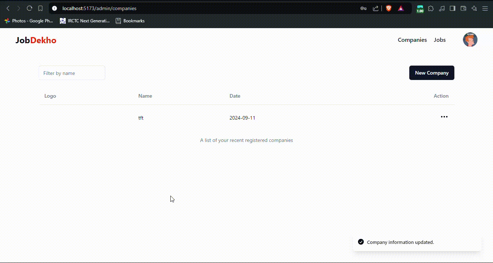

# Job-Dekho

## 📌 Overview

**Job-Dekho** is a job portal web application that helps job seekers find relevant job opportunities and allows recruiters to post job listings. It features role-specific access for applicants and recruiters, job filtering, and bookmarking functionality.

## 🚀 Features

- 🏢 **Role-Specific Access**: Different functionalities for applicants and recruiters.
- 🔍 **Advanced Job Search**: Search for jobs based on title, location, and industry.
- 📝 **Job Applications**: Apply for jobs directly from the platform.
- 🏷 **Filters**: Filter jobs by salary, location, and industry.
- 🛡 **Authentication**: Secure login and registration system.

## 🛠 Tech Stack

- **Frontend**: React.js, Tailwind CSS
- **Backend**: Node.js, Express.js
- **Database**: MongoDB
- **State Management**: Redux

## 🔧 Installation & Setup

1. **Clone the repository**:

   ```sh
   git clone https://github.com/aditya3492gupta/Job-Dekho.git
   cd Job-Dekho
   ```

2. **Install dependencies**:

   ```sh
   npm install
   ```

3. **Setup environment variables** (create a `.env` file and add necessary keys like database URL, JWT secret, etc.).

4. **Start the development server**:

   ```sh
   npm run dev
   ```

5. **Backend setup** (if separate):

   ```sh
   cd backend
   npm install
   npm run dev
   ```

## 📜 API Endpoints

| Method | Endpoint               | Description          |
| ------ | ---------------------- | -------------------- |
| GET    | `/api/jobs`            | Fetch all jobs       |
| POST   | `/api/jobs`            | Create a new job     |
| GET    | `/api/jobs/:id`        | Fetch job details    |
| POST   | `/api/apply`           | Apply for a job      |
| GET    | `/api/user/saved-jobs` | Retrieve saved jobs  |
| POST   | `/api/user/save-job`   | Save a job for later |

## 📽️ Demo


---

✨ Developed by **Aditya Gupta** 🚀

